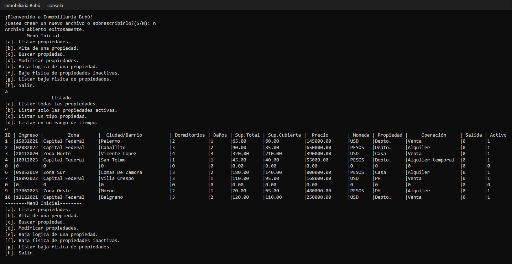
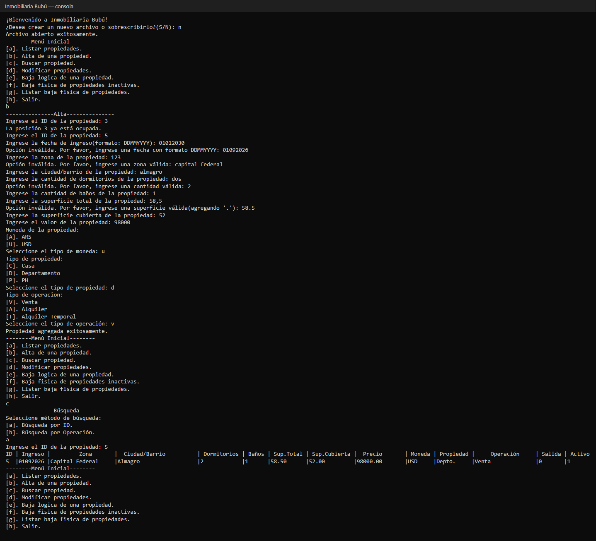
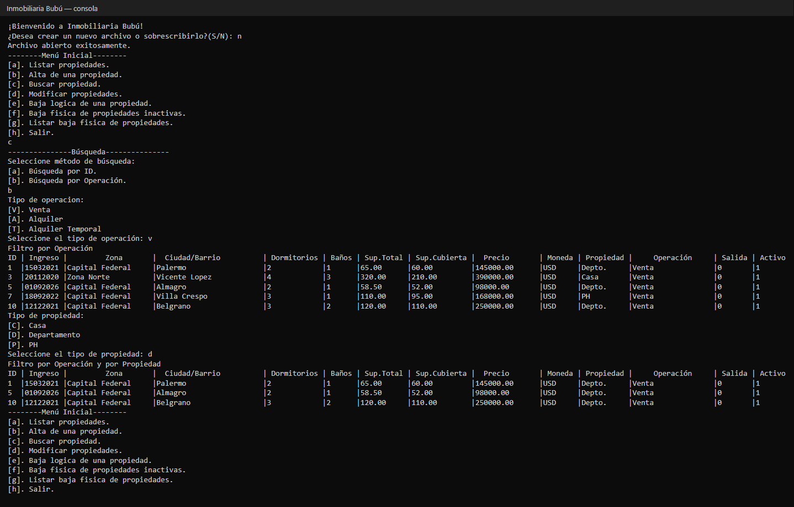
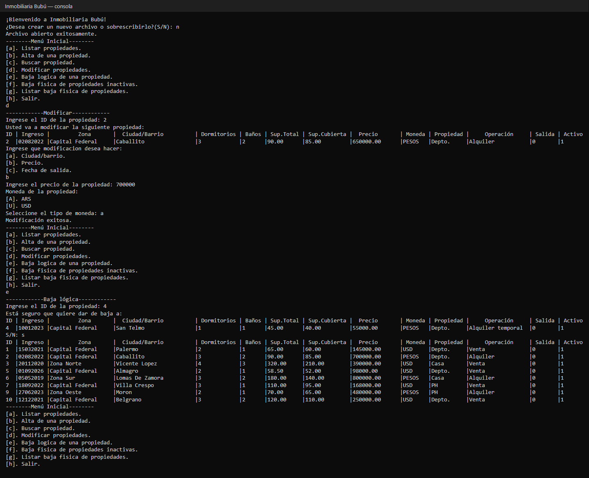
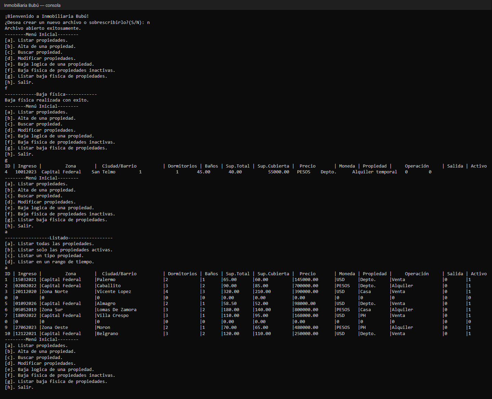

# Inmobiliaria Bubú: gestión de propiedades en C con archivos binarios

Programa de consola para administrar las propiedades de una inmobiliaria: alta, búsqueda, modificación y bajas, con los datos guardados en un archivo binario de acceso directo. Lo hicimos en equipo como trabajo práctico de Laboratorio de Computación II (2023). Este repo es mi fork, donde después lo ordené, corregí bugs y lo documenté.

## Problema que resuelve

Una inmobiliaria necesita llevar el registro de sus propiedades (casas, departamentos y PH en venta o alquiler) sin base de datos, solo con archivos. El programa permite:

- **Listar** todas las propiedades, solo las activas, las de un tipo o las que ingresaron en un rango de fechas.
- **Dar de alta** una propiedad validando cada dato que se ingresa.
- **Buscar** por ID o por tipo de operación y después por tipo de propiedad.
- **Modificar** el barrio, el precio o la fecha de salida.
- **Dar de baja** en dos pasos: una baja lógica, que marca la propiedad como inactiva, y una baja física, que la saca del archivo y la guarda en un archivo de texto histórico con la fecha del día.

## Demo

Capturas del programa corriendo en una consola de Windows con los datos de ejemplo del repo.

**Listado completo.** Los registros con ID 0 son posiciones vacías del archivo (lo explico en [Cómo funciona](#cómo-funciona)).

**Alta de una propiedad.** Se intenta un ID ocupado y después se cargan datos inválidos (una fecha futura, una zona con números, "dos" como cantidad, una coma como separador decimal). El programa rechaza cada uno y vuelve a preguntar. Al final, la búsqueda por ID muestra la propiedad guardada en el hueco del ID 5, con el barrio capitalizado automáticamente.

**Búsqueda por operación y tipo:** primero todas las propiedades en venta, después solo los departamentos.

**Modificación del precio y baja lógica.** Después de la baja, el listado de activas ya no incluye la propiedad 4.

**Baja física.** La propiedad inactiva pasa al archivo `propiedades_bajas_<fecha>.xyz` y su lugar en `propiedades.dat` queda vacío.

## Tecnologías

- **C**, solo con la biblioteca estándar (`stdio.h`, `string.h`, `ctype.h`, `time.h`).
- **Archivos binarios de acceso directo** (`fread`, `fwrite` y `fseek`) para los datos, y un archivo de texto para el historial de bajas.
- **gcc (MinGW-w64)** en Windows.

## Cómo funciona

### El ID es la posición en el archivo

`propiedades.dat` es una secuencia de structs `propiedad_t`, todos del mismo tamaño. La propiedad con ID *n* se guarda en el registro *n*, así que leerla o escribirla es un solo `fseek` a `(n - 1) * sizeof(propiedad_t)`, sin recorrer el archivo. Esa era la consigna del TP, y es la idea central del programa.

La contra es que los IDs no tienen por qué ser consecutivos. Si se da de alta el ID 12 y el archivo tiene 10 registros, el programa completa el 11 con un registro vacío (ID 0) para que las posiciones sigan coincidiendo con los IDs. Por eso aparecen filas en 0 en el listado. El alta también puede reutilizar esos huecos.

### Dos tipos de baja

- **Baja lógica:** pone `flag_activo` en 0. La propiedad sigue en el archivo, así que no se pierde información y se puede seguir consultando.
- **Baja física:** recorre el archivo, escribe las propiedades inactivas en un `.xyz` de texto con la fecha del día y reemplaza sus registros por registros vacíos. No compacta el archivo, porque correr los registros rompería la regla de "ID = posición".

### Validación de lo que se ingresa

Todo lo que escribe el usuario se lee como texto y se valida antes de convertirlo. Si en cambio se lee un número con `scanf("%d")` y el usuario escribe letras, `scanf` falla y las letras quedan en el buffer, con lo que la próxima lectura vuelve a fallar. Cada función de `entrada.c` repite la pregunta hasta recibir un valor válido. Las reglas son:

- Enteros y reales solo con dígitos, y el punto como separador decimal.
- Fechas en formato `DDMMYYYY` que existan (teniendo en cuenta días por mes y años bisiestos), desde 1900. La fecha de ingreso y la de salida no pueden ser futuras.
- Textos sin números. Además se capitaliza cada palabra, para que "capital federal" y "Capital Federal" queden guardados igual.

Las fechas se guardan como texto y, para filtrar por rango, se convierten al entero `YYYYMMDD`. En ese formato comparar fechas es comparar números.

### Estructura del código

| Archivo | Responsabilidad |
|---|---|
| `src/main.c` | Menú principal. |
| `src/operaciones.c` | Una función por opción del menú (listar, alta, buscar, modificar, bajas). |
| `src/propiedad.c` | El struct, el acceso por ID al archivo y la impresión de una propiedad. |
| `src/entrada.c` | Lectura de teclado: pedir un dato y repetir la pregunta hasta que sea válido. |
| `src/validaciones.c` | Reglas de validación de números, fechas y texto. |

## Cómo correrlo

Corrélo desde la raíz del repo. Al arrancar pregunta si querés crear un archivo nuevo: con **N** abre el `propiedades.dat` de ejemplo y con **S** empieza con uno vacío (y borra los datos de ejemplo).

## Qué aprendí y qué mejoraría

**Qué aprendí**

- A trabajar con archivos binarios de acceso directo y a pensar el diseño alrededor de eso: IDs como posiciones, registros vacíos y la diferencia entre baja lógica y baja física.
- A no dar por hecho que un cambio "no cambia nada". Para reorganizar el código armé escenarios que recorren todo el menú. Comparé la salida y los archivos resultantes del programa original contra la versión nueva, corriendo ambos en una consola real, y así confirmé que la reestructuración no cambió el comportamiento.
- Fue mi primer proyecto en equipo con Git: ramas por integrante, merges y resolución de conflictos.

**Qué mejoraría** (bugs conocidos que dejé como estaban para no cambiar el comportamiento del TP):

- **Alta:** si el ID elegido está ocupado y el siguiente que se ingresa está más allá del final del archivo, la propiedad se guarda con un ID incorrecto y no se completan los huecos.
- **Baja lógica:** no carga la fecha de salida con la fecha del día, aunque la consigna lo pedía.
- **Archivo de bajas:** el nombre sale con espacios (`propiedades_bajas_ 1 92026.xyz`). Con `%02d` quedaría `01092026`.
- **Listar bajas:** si todavía no se hizo ninguna baja física en el día, el programa se cierra en lugar de avisar.

## Autoría

Este proyecto es un fork de **[dampal/TP_Archivos](https://github.com/dampal/TP_Archivos)**, el trabajo práctico que hicimos en equipo en octubre de 2023.

**Autores:** Damián Palomba, Franco Medina y Sol Alcaraz.

**Mi participación en la versión original** (según el historial de commits):

- Desarrollé el **alta de propiedades**: la carga y validación de cada campo, el control de IDs ocupados y la selección de moneda, tipo de propiedad y operación.
- Agregué la fecha de salida al struct e hice el **listado** con su submenú, incluido el filtro por rango de fechas.
- Hice **modificar propiedad**: barrio, precio y fecha de salida.
- Sugerí cambios en la baja lógica que Franco incorporó. También ajusté el formato de impresión, reorganicé el archivo al cierre y completé el README original.

**Mejoras que hice en este fork** (rama `pulido-portfolio`):

- Corregí cuatro bugs:
  - La baja física corrompía `propiedades.dat` y duplicaba las bajas en el `.xyz`.
  - El listado por tipo repetía la última propiedad.
  - `bajaFisica` devolvía un puntero indefinido al que después se le hacía `fclose`.
  - `gets()` podía desbordar el buffer con textos largos.
- Separé el programa, que era un único archivo de casi 800 líneas, en módulos con responsabilidades claras. La parte de pedir un dato y validarlo estaba copiada campo por campo, así que la pasé a unas pocas funciones que se reutilizan. También eliminé código muerto y comentarios que remitían a la consigna.
- Saqué el ejecutable del repositorio y reemplacé los datos de ejemplo por propiedades realistas.
- Escribí este README y generé las capturas de la demo.
